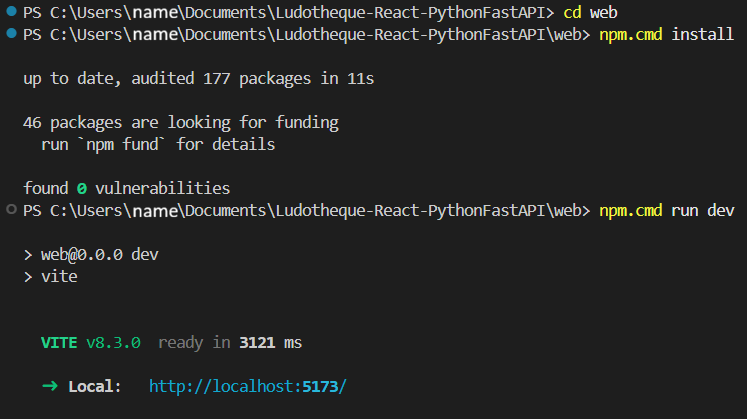

# Ludotheque-React-PythonFastAPI

## Description :

- A full-stack board game collection application with a React and TypeScript frontend and a Python FastAPI backend.

## Prerequisites:

- Python and pip
- Node.js with npm
- Docker with Docker Compose

## Installation and startup

- From the project root, install the API dependencies and start the database and API:

        - py -m pip install -r api/requirements.txt
        - cd api
        - docker compose up -d
        - cd ..
        - py -m api.seed
        - py -m uvicorn api.main:app --reload

- In a second terminal, start the web application:

        - cd web
        - npm install
        - npm run dev

- On Windows, use `npm.cmd` instead of `npm` if PowerShell prevents running npm scripts.
- Open the API documentation at [http://127.0.0.1:8000/docs](http://127.0.0.1:8000/docs).

## Demonstration

- In the first terminal : 

-----

- In the second terminal : 

- You can now launch the frontend and retrieve the data from the backend.

## Structure

    Ludotheque-React-PythonFastAPI/
    ├── README.md
    ├── .gitignore
    ├── LICENSE
    ├── api/
    │   ├── Readme.md
    │   ├── .env.example
    │   ├── .gitignore
    │   ├── requirements.txt
    │   ├── docker-compose.yml
    │   ├── main.py
    │   ├── seed.py
    │   ├── __init__.py
    │   ├── core/
    │   │   ├── config.py
    │   │   ├── errors.py
    │   │   ├── security.py
    │   │   └── __init__.py
    │   ├── db/
    │   │   ├── session.py
    │   │   └── __init__.py
    │   ├── dependencies/
    │   │   ├── auth.py
    │   │   └── __init__.py
    │   ├── models/
    │   │   ├── collection.py
    │   │   ├── item.py
    │   │   ├── user.py
    │   │   └── __init__.py
    │   ├── routers/
    │   │   ├── auth_routes.py
    │   │   ├── collection_routes.py
    │   │   ├── items_routes.py
    │   │   └── __init__.py
    │   ├── schemas/
    │   │   ├── collection.py
    │   │   ├── items.py
    │   │   ├── user.py
    │   │   └── __init__.py
    │   └── services/
    │       ├── collection_services.py
    │       ├── items_services.py
    │       ├── user_service.py
    │       └── __init__.py
    ├── user_documentation/
    │   ├── doc.md
    │   └── screen/
    │       ├── terminalApi.png
    │       ├── terminalDownload.png
    │       └── terminalWeb.png
    └── web/
        ├── README.md
        ├── .gitignore
        ├── package.json
        ├── package-lock.json
        ├── index.html
        ├── vite.config.ts
        ├── eslint.config.js
        ├── tsconfig.json
        ├── tsconfig.app.json
        ├── tsconfig.node.json
        ├── public/
        │   ├── favicon.svg
        │   └── icons.svg
        └── src/
            ├── App.tsx
            ├── App.css
            ├── index.css
            ├── main.tsx
            ├── assets/
            │   ├── font.png
            │   ├── hero.png
            │   ├── react.svg
            │   └── vite.svg
            ├── components/
            │   ├── Button.tsx
            │   ├── Card.tsx
            │   ├── CatalogueCard.tsx
            │   ├── CatalogueList.tsx
            │   ├── CollectionCard.tsx
            │   ├── CollectionList.tsx
            │   ├── Footer.tsx
            │   ├── Form.tsx
            │   └── Navbar.tsx
            ├── context.tsx/
            │   ├── authContext.tsx
            │   └── collectionContext.tsx
            ├── hooks/
            │   ├── localStorage.ts
            │   └── toggle.ts
            ├── services/
            │   ├── authService.ts
            │   ├── collectionService.ts
            │   ├── httpClient.ts
            │   └── itemService.ts
            ├── types/
            │   ├── api.ts
            │   └── type.ts
            └── view/
                ├── AccountPage.tsx
                ├── CollectionPage.tsx
                ├── HomePage.tsx
                ├── LegalPage.tsx
                ├── LoginPage.tsx
                ├── NotFoundPage.tsx
                └── RegisterPage.tsx

## Contribution

- Maxime Collette Poujol

- Thomas Davrou

## License

- This project is licensed under the MIT License.

## Additional information

- This is a student project developed as part of a Ynov project.
