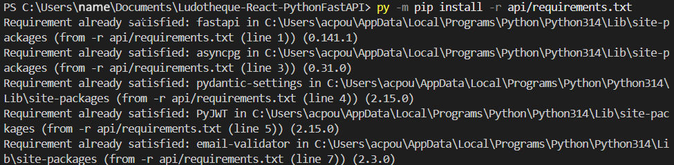
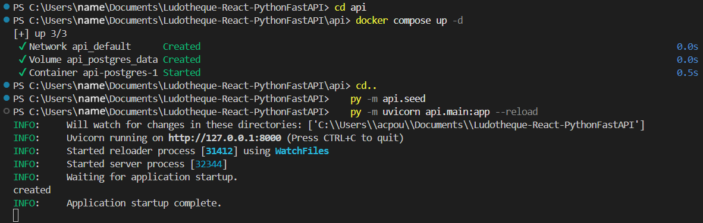

# Ludotheque-React-PythonFastAPI : API

## Description :

- This part of the project is dedicated to the FastAPI backend.

- It allows you to explore and test the different aspects of the backend independently from the frontend.

- His goal is to provide data from the database to the users (item, catalogue, collection, account, etc.)

- The API provides a video game catalogue and lets authenticated users manage their personal collection.

- we manages errors too, and assure security of the several routes through an authentication system, password hashing, authorized origins, and data validation.

- It provides a structured and secure interface between the database and the frontend application.

## Prerequisites:

- python 3.14+
- IDE
- Docker Desktop

## Installation and startup: 

- Before any command, make sure docker destop is running and your environnement variables (see .env.example) are configured.

- From the project root, run:

        - py -m pip install -r api/requirements.txt
        - cd api
        - docker compose up -d
        - cd..    
        - py -m api.seed  
        - py -m uvicorn api.main:app --reload 

        - cd web
        - npm install
        - npm run dev

- The backend will be started.  

- Once the project is launched, you can try it yourself or follow the quick start in the API documentation in the user documentation.

## Demonstration : 

-----

- You can nown crtl click on "http://127.0.0.1:8000" and access Swagger by adding /docs to the end of the URL.end.

## Structure :

    api/
    ├── main.py
    ├── seed.py
    ├── requirements.txt
    ├── docker-compose.yml
    ├── .env.example
    ├── core/
    │   ├── config.py
    │   ├── errors.py
    │   └── security.py
    ├── db/
    │   └── session.py
    ├── dependencies/
    │   └── auth.py
    ├── models/
    │   ├── collection.py
    │   ├── item.py
    │   └── user.py
    ├── routers/
    │   ├── auth_routes.py
    │   ├── collection_routes.py
    │   └── items_routes.py
    ├── schemas/
    │   ├── collection.py
    │   ├── items.py
    │   └── user.py
    └── services/
        ├── collection_services.py
        ├── items_services.py
        └── user_service.py

## Contributor :

- Maxime Collette Poujol

## License :

- This project is licensed under the MIT License.

## Additional information :

- this a student project developed within the context of a Ynov project
- Interactive API documentation is available at `/docs` while the backend is running.
- Collection routes require a Bearer token obtained through `/auth/login`.
- CORS origins and authentication settings are configured through environment variables.
- This project is intended for educational purposes and is not yet hardened for production use.