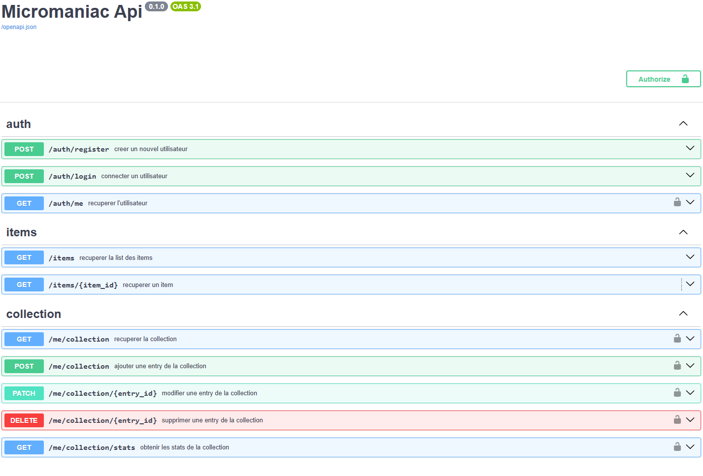
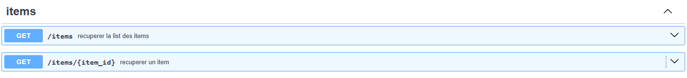
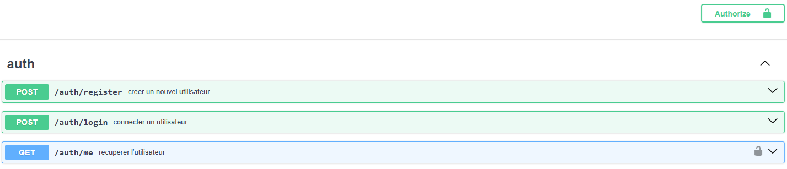
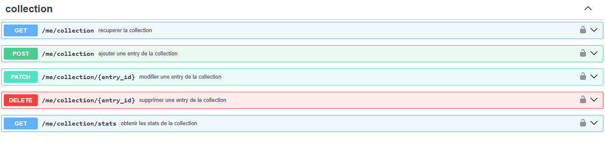

# API — Documentation utilisateur

## Présentation de la solution

Ludothèque est une application de gestion de collection de jeux vidéo. Elle permet à un utilisateur de consulter un catalogue, d’ajouter des jeux à sa collection personnelle, de les noter et de commenter chaque titre, puis de suivre ses statistiques de collection.

Elle s’adresse aux joueurs et collectionneurs souhaitant organiser leur ludothèque de manière simple et sécurisée. L’application propose notamment :

L'API ludothèque gèrent les différentes routes comme Item, Auth ou collection au travers de servies qui commique et mettent a jour une base de donnée.
Elle permet diverse fonctionnalité comme :

    - un catalogue de jeux avec recherche et filtrage par catégorie ;
    - une inscription et une authentification utilisateur ;
    - une collection privée associée à chaque compte ;
    - la modification du statut, de la note et du commentaire d’un jeu ;
    - des statistiques globales sur la collection.

## Quick start

Suivez ces étapes pour lancer le projet et accéder à l’API :

1. Dans le terminal, à la racine du projet, exécutez les commandes suivantes :

        py -m pip install -r api/requirements.txt
        cd api
        docker compose up -d
        cd ..
        py -m api.seed
        py -m uvicorn api.main:app --reload

2. Ouvrez ensuite l’adresse de l’API dans le navigateur :

        http://127.0.0.1:8000

3. Ajoutez `/docs` à la fin de l’URL pour accéder à la documentation Swagger :

        http://127.0.0.1:8000/docs

**Résultat attendu :** vous accédez à la documentation Swagger de l’API et pouvez tester les routes de manière interactive.

## Guide des fonctionnalités

A premimière vu, vous devez voir ceci : 

### items

1. Voir la partie items disponible dans le Swagger avec les routes :

---     

2. Les routes de Collection permettent :
    -  parcourir la liste des jeux
    -  rechercher un titre, filtrer par catégorie et consulter le détail d’un jeu.

3. Les routes sont accessibles directement sans autorisation.

4. Pour chaque action, il y a des paramètres à renseigner :
    - recherche textuelle (`q`) ;
    - catégorie (`categorie`) ;
    - numéro de page (`page`) ;
    - nombre d’éléments (`limit`) ;
    - recherche par identifiant avec (`item_id`).

**Résultat attendu :** l’utilisateur obtient la liste des jeux disponibles ou le détail d’un jeu précis sans être authentifié.

### auth

1. Voir la partie auth disponible dans le Swagger avec les routes suivantes :

---

2. Les routes d’authentification permettent :
    - de créer un compte avec une adresse e-mail et un mot de passe ;
    - de se connecter pour recevoir un jeton JWT ;
    - de récupérer l’utilisateur actuel.

3. La partie Authentification est accessible via le bouton « Authorize » dans Swagger, ce qui débloque aussi l’accès à la collection.

4. Pour chaque action il y a des paramètres à renseigner :
    - email et mot de passe pour l’inscription et la connexion ;
    - token JWT dans l’en-tête `Authorization: Bearer <token>` pour les routes protégées ;
    - identifiant d’entrée (`entry_id`) pour modifier ou supprimer un élément de la collection.

**Résultat attendu :** l’utilisateur est authentifié et peut accéder aux routes protégées de sa collection personnelle.

### collection

1. Voir la partie collection disponible dans Swagger avec les routes suivantes :

---

2. Les routes de Collection permettent :
    - de récupérer la collection de l’utilisateur ;
    - d’ajouter un jeu à la collection ;
    - de modifier un élément de la collection (statut, note, commentaire) ;
    - de supprimer un jeu de la collection ;
    - de récupérer les statistiques de la collection.

3. Pour avoir accès à cette partie, il faut d’abord passer par l’authentification. Les routes sont protégées et nécessitent un token valide.

4. Pour chaque action, des paramètres sont à renseigner (sauf pour la récupération de la collection et des statistiques) :
    - pour ajouter un jeu, il faut remplir `item_id`, `statut`, `note` et `commentaire` ;
    - pour modifier un jeu, il faut fournir l’`entry_id` et les champs à mettre à jour ;
    - pour supprimer un jeu, il faut renseigner son `entry_id`.

**Résultat attendu :** l’utilisateur possède une collection personnelle consultable et modifiable, avec des statistiques calculées automatiquement à partir de ses entrées.

## Liste des commandes

| Commande | Description |
|---|---|
| `py -m pip install -r api/requirements.txt` | Installe les dépendances Python du backend. | 
| `cd api` | Se place dans le dossier backend. | 
| `docker compose down -v` | Éteint la base PostgreSQL dans Docker. | 
| `docker compose up -d` | Démarre la base PostgreSQL dans Docker. | 
| `py -m api.seed` | Remplit la base avec les données de jeux. | 
| `py -m uvicorn api.main:app --reload` | Lance l’API FastAPI en mode développement. | 

## Prérequis

- Python 3.12+ ou version compatible avec le projet ;
- Node.js et npm ;
- Docker Desktop ou Docker Engine ;
- Un IDE comme VS Code ;
- Un navigateur moderne pour accéder à l’application web et à Swagger.

## Accès et configuration

1. Configuration : le fichier `api/.env.example` contient les variables à renseigner. Il faut créer un fichier `.env` avec les valeurs adaptées à l’environnement, notamment :
   - `SECRET_KEY` ;
   - `ALGORITHM` ;
   - `ACCESS_TOKEN_EXPIRE_MINUTES` ;
   - `DATABASE_URL` ;
   - `CORS_ORIGINS`.
2. Aide et dépannage : si le projet ne démarre pas, vérifiez que Docker est bien lancé, que les dépendances Python sont installées et que le fichier `.env` est correctement renseigné. Les fichiers `README.md` et la documentation Swagger permettent de confirmer le bon fonctionnement des routes.
